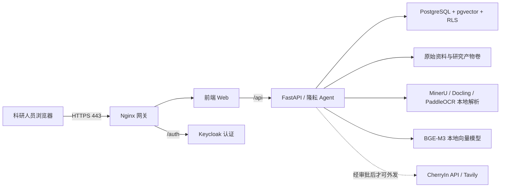

# 隆耘 Agent 育种智能体内网生产上线实施手册

> 适用版本：v1.5.0。本文面向农科院内网正式试点，不适用于本机开发或临时演示。

## 1. 上线结论与边界

当前代码已整理为可部署的内网生产编排，但只有在完成本手册的 DNS、HTTPS 证书、正式密码、备份和验收步骤后，才可以对科研人员开放。

生产模式与本机演示模式的区别：

- 本机开发仍使用 `docker-compose.yml`，可以保留 `localhost` 和调试端口；禁止将它用于生产。
- 生产环境只使用 `docker-compose.lan.yml` 和 `deploy/.env.production`。
- 外部网络仅开放一个 HTTPS 入口；PostgreSQL、API、MinerU、模型缓存和 Keycloak 全部仅在 Docker 内部网络可见。
- 浏览器、Keycloak 回调、前端 API 均使用同一域名的 `https://域名` 与 `/auth` 路径，不再使用 `localhost`、`5183`、`8088` 等演示地址。
- 生产 API 会校验生产变量：演示密码、非 HTTPS 回调、通配符 CORS 或缺失可信主机名会导致容器启动失败。

## 2. 目标架构



## 3. 上线前需由农科院与运维确认的事项

1. 申请稳定的内网 DNS，例如 `longyun-agent.institute.local`；不要以 IP 或 `localhost` 作为正式入口。
2. 为该域名签发可被院内浏览器信任的 HTTPS 证书，建议由院内 CA 签发。准备 PEM 格式证书链 `server.crt` 和私钥 `server.key`。
3. 准备一台 Linux 服务器。建议试点最低配置：8 核 CPU、32 GB 内存、至少 200 GB 可用 SSD；若文献解析、OCR 或模型并发较多，建议 16 核、64 GB 内存及独立数据盘。
4. 安装 Docker Engine 与 Docker Compose v2；部署账号只能通过堡垒机或受控运维通道登录，并具备 Docker 权限。
5. 防火墙只允许科研终端访问 `443/tcp`；禁止开放 `5432`、`8000`、`8001`、`8080`、`5183`、`8088`。
6. 确定敏感数据外发政策。CherryIn API 与 Tavily 是外部服务；未书面批准前，将 `YUNNAN_API_KEY`、`TAVILY_API_KEY` 留空，平台仍可使用本地结构化查询、知识库、文件解析和统计能力。
7. 确定加密备份位置与保留策略。建议每日增量、每周全量、至少保留 30 天，并定期做恢复演练。

## 4. 首次部署步骤

### 4.1 准备代码与证书

在受控服务器上获取已审核的项目代码，进入项目根目录：

```bash
cd /srv/rice-data-governance-platform-demo
mkdir -p deploy/certs
chmod 700 deploy/certs
install -m 600 /secure-path/server.crt deploy/certs/server.crt
install -m 600 /secure-path/server.key deploy/certs/server.key
```

证书和私钥不得提交到 Git，不得复制至临时共享目录。

### 4.2 创建生产环境变量

```bash
cp deploy/.env.production.example deploy/.env.production
chmod 600 deploy/.env.production
vi deploy/.env.production
```

必须修改以下内容：

```dotenv
PUBLIC_PLATFORM_URL=https://longyun-agent.institute.local
PUBLIC_PLATFORM_HOST=longyun-agent.institute.local
HTTPS_PORT=443

POSTGRES_PASSWORD=<独立随机密钥，建议至少24位>
APP_DATABASE_PASSWORD=<独立随机密钥，建议至少24位>
KEYCLOAK_DATABASE_PASSWORD=<独立随机密钥，建议至少24位>
KEYCLOAK_ADMIN_PASSWORD=<独立随机密钥，建议至少24位>
INITIAL_RESEARCHER_PASSWORD=<首次登录密码>
INITIAL_PROCESSOR_PASSWORD=<首次登录密码>
INITIAL_FIELD_ADMIN_PASSWORD=<首次登录密码>
```

可用以下方式生成密码，不要将命令输出写入终端日志或工单：

```bash
openssl rand -base64 32
```

首次登录后应要求各账号自行修改初始密码，并由管理员停用不需要的演示账号。

### 4.3 预检与构建

```bash
chmod +x deploy/preflight.sh deploy/backup.sh deploy/postgres/10-create-production-roles.sh
./deploy/preflight.sh
docker compose --env-file deploy/.env.production -f docker-compose.lan.yml up -d --build
docker compose --env-file deploy/.env.production -f docker-compose.lan.yml ps
```

首次初始化空数据库时，PostgreSQL 会自动建立：

- `rice`：数据库迁移与初始化账号，仅容器内使用；
- `rice_app`：API 运行账号，受 PostgreSQL RLS 限制；
- `keycloak`：仅拥有 `keycloak` schema 的认证服务账号。

不要手工删除 `postgres_data` 卷来重置账号或重新导入 Realm。

### 4.4 模型预热

在开放科研人员前预热本地向量模型和文档解析依赖：

```bash
docker compose --env-file deploy/.env.production -f docker-compose.lan.yml --profile warmup run --rm model-warmup
```

如服务器不能联网，应由运维提前将经过安全审核的模型缓存放入受控卷或内网镜像仓库，再执行预热验证。

## 5. 上线验收

### 5.1 技术验收

```bash
curl --cacert deploy/certs/server.crt https://longyun-agent.institute.local/healthz
curl --cacert deploy/certs/server.crt https://longyun-agent.institute.local/api/health
docker compose --env-file deploy/.env.production -f docker-compose.lan.yml logs --tail=100 api keycloak gateway
```

预期：两个健康检查均返回成功；`docker compose ps` 中 `db`、`api`、`web`、`mineru` 与 `gateway` 为运行/健康状态；宿主机没有对外监听数据库和 API 端口。

### 5.2 业务验收

1. 两名科研人员分别登录，确认彼此看不到对方会话、私有附件、私有知识库和结果库。
2. 数据处理员上传脱敏区域试验资料包，完成质量检查、审核和发布；科研人员只能检索已发布标准数据。
3. 上传 PDF、Office 和图片各一份，确认解析、证据卡片、结果库和删除会话后的附件清理流程可用。
4. 执行区域试验比较、Tukey 多重比较、多年多点稳定性和 PDF 报告生成，检查结果可追溯至资料包与分析运行编号。
5. 上传 VCF/PLINK 样本，确认 QC 结果在完成材料映射前不能作为正式分析版本下载或进入 GWAS。
6. 若启用 CherryIn/Tavily，使用经批准的非敏感样例验证；再检查日志中不记录 API Key 与附件正文。

## 6. 从旧演示环境迁移

旧 `docker-compose.yml` 或旧 `.env.lan` 的 `localhost:5183`、`:8088` 不能直接升级为生产环境。迁移顺序：

1. 在旧环境执行 `./deploy/backup.sh <旧环境变量文件>`，并校验 `SHA256SUMS`。
2. 停止旧编排，但不要立即删除旧卷：`docker compose -f docker-compose.yml down`。
3. 按本手册准备 DNS、证书和新的 `deploy/.env.production`。
4. 若复用已有 PostgreSQL 卷，先由 DBA 为 Keycloak 创建独立 `keycloak` 登录角色和同名 schema；初始化脚本只在**空** PostgreSQL 卷首次启动时执行。
5. 在测试时段以备份副本验证登录、RLS、附件、知识库和报告生成，再切换科研人员入口。
6. Keycloak Realm 首次导入后，客户端回调地址保存在数据库内。更换域名时，应通过 Keycloak 管理控制台更新 `rice-research-web` 的 Redirect URI 与 Web Origins，不能靠重建容器解决。

## 7. 日常运维、备份与回滚

### 7.1 每日备份

```bash
./deploy/backup.sh
```

备份包含 PostgreSQL、原始导入资料和研究产物；不包含可重建的模型缓存。脚本生成后，必须立即复制到加密且访问受控的备份位置。

### 7.2 发版

1. 先在隔离测试环境完成构建、登录、数据导入、报告生成和恢复验证。
2. 记录版本号和变更说明，重大架构调整在 `docs/releases/` 中补充中文说明。
3. 上线前完成备份，再更新经过审核的代码与镜像标签。
4. 执行 `docker compose --env-file deploy/.env.production -f docker-compose.lan.yml up -d --build`。
5. 按第 5 节执行健康检查与核心业务回归。

### 7.3 回滚

若本次应用升级失败且数据库没有不可逆迁移，可将应用镜像标签回退至上一稳定版本并重新启动。若涉及数据库结构或数据写入异常，必须先停止写入、保留日志，再由 DBA 用最近一次经校验的备份恢复。禁止使用 `docker volume prune`、`docker system prune` 或未确认项目名的删除命令。

## 8. 当前仍需在正式交付前补齐的治理事项

- 为 CherryIn、Tavily 建立“允许外发/禁止外发”的材料分级和审批策略；敏感材料应路由到后续本地大模型能力。
- 将演示账号改为院内实名账号与实际组织架构，并制定离职、转岗、密码重置和审计留存流程。
- 建立对象存储或受控文件卷的容量监控、日志监控和备份恢复演练。
- 完成真实农科院资料包的字段映射验收，避免将模拟数据标准直接当作最终生产标准。
- 通过安全测评后再开放外网、VPN 或跨院协作访问；本手册默认仅院内网络。
